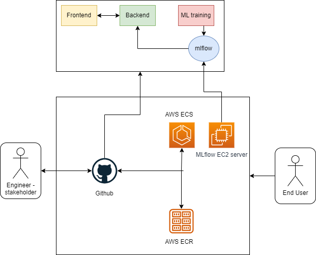

# mlopscasestudy24 - Santander Customer Transaction Classification.

## Architecture:

## Pre-requisites to install for Local run.
1. Poetry - Python package manager [Poetry](https://python-poetry.org/docs/#installation)
2. Python - 3.9
3. MLflow server - [MLflow](https://mlflow.org/docs/latest/tracking/tutorials/local-database.html)
4. Docker Compose - [DockerCompose](https://docs.docker.com/compose/install/)

## Steps to run the application locally.
1. Set the `mlflow.set_tracking_uri(<local mlflow server>)` in the "training.py" file in "model_training" folder
2. in the root folder, run `poetry install` where the "pyproject.toml" is present.
3. Activate the virtual env - `pathtothevirtualenv\Scripts\activate.ps1` for powershell.
4. Train the model - `python ./training.py`
5. in the frontend/ui.py file modify the backend variable to the localhost backend url. example - `http://localhost:8000` 
6. Run the following commands to deploy the backend and the frontend locally `docker-compose build` & `docker-compose up`

Notes - 
1. The containers will spin up, the backend service should be available at `http://localhost:8000/docs` for backend testing.
2. The frontent service should be available at `http://localhost:8501`

## Tools selected for this Case Study and Justification.
1. AWS cloud platform - free tier. AWS was selected as the basis of the platform as it is the most flexible cloud vendor available where the services provided in the free tier are really expansive. AWS services used  - EC2 instance, RDBMS, ECR, ECS, S3.
2. MLflow - it is an open source tool that is used for the correct model lifecycle mamagement. The versatility of leveraging this tool, it helps in model version control, experiment tracking, run trackin and etc. In this case study I have deployed a self hosted mlflow server on an ec2 instance in AWS.
3. Git actions - CI CD platform for this case study, it is a really good open source tool to setup your Continous Integration and Continous Deployment.
4. ECS - Elastic Container Service, It is aws serverless service used to deploy the containerized applications.
5. LightGBM model - LightGBM is a gradient boosting framework that uses tree-based learning algorithms. It provides a range of parameters that can be tuned to optimize the performance of the model. The parameters can be set both in a configuration file and on the command line. The lightgbm.LGBMClassifier and lightgbm.LGBMModel classes are used to construct gradient boosting models in LightGBM.
